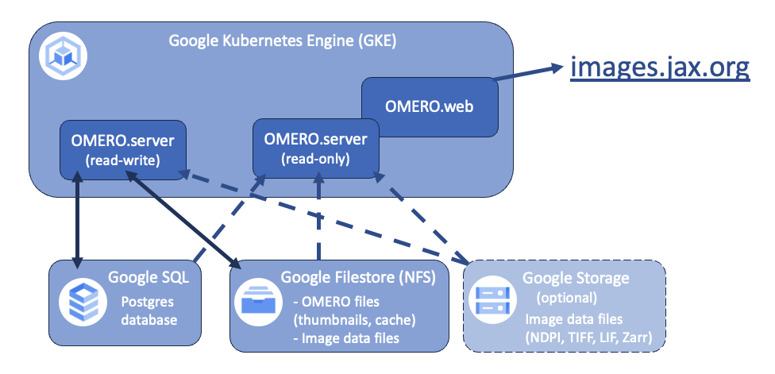

# Kubernetes templates for OMERO as run at The Jackson Laboratory
The Jackson Laboratory hosts a public image repository using OMERO on Google Cloud at [images.jax.org](https://images.jax.org). These templates are made to mimic that OMERO deployment and related testing environments as closely as possible.

As a lightweight template repository, the current goal is to only require `kubectl` and either a local Kubernetes cluster or Google Cloud Project (GCP). _Kustomize_ is used to provide multiple optional deployment configurations in the GCP yamls, run as `kubectl apply -k`. _In the future this may be upgraded to Helm charts or Terraform._

## Deployment overview

- One read-write OMERO server is run as an ephemeral Kubernetes pod and used for OMERO setup, data imports, and admin tasks
    - The read-write OMERO server has read-write access to the database and the NFS server with the OMERO directories. All data is imported [in-place](https://omero.readthedocs.io/en/stable/sysadmins/in-place-import.html) with `--transfer ln_s`, so image data (either on NFS or object storage) can be mounted read-only.
- One (or more) [read-only](https://omero.readthedocs.io/en/stable/developers/Server/Clustering.html#read-only) OMERO servers use a read-only database user and mount both the data and OMERO directories as read-only
- One (or more) OMERO web deployment runs both OMERO web and Nginx and connects to the read-only OMERO server

# Other relevant repositories
We are not involved with these repositories, but they are doing similar things:
- [IDR Ansible deployment (IDR/deployment)](https://github.com/IDR/deployment)
- [Helm charts for OMERO (manics/kubernetes-omero)](https://github.com/manics/kubernetes-omero)
- [OMERO on AWS (aws-samples/digital-pathology-on-aws)](https://github.com/aws-samples/digital-pathology-on-aws)